<h2>TensorFlow-FlexUNet-Image-Segmentation-SMDG-Glaucoma (2026/02/21)</h2>
Sarah T.  Arai 
Software Laboratory antillia.com  
This is the first experiment of Image Segmentation for <b>SMDG-Glaucoma</b> based on our <a href="./src/TensorFlowFlexUNet.py">TensorFlowFlexUNet</a> 
(TensorFlow Flexible UNet Image Segmentation Model for Multiclass), 
and a 512x512 pixels  <a href="https://drive.google.com/file/d/13JrBJXzsw_DzMQ7JbgDXRqdAZIUCzKR6/view?usp=sharing">
 SMDG-Glaucoma-ImageMask-Dataset.zip
 </a>, which was derived by us from <a href="https://www.kaggle.com/datasets/deathtrooper/multichannel-glaucoma-benchmark-dataset">
<b>SMDG, A Standardized Fundus Glaucoma Dataset</b></a> on the kaggle.com
  

<b>Actual Image Segmentation for SMDG-Glaucoma Images of 512x512 pixels</b> 
As shown below, the inferred masks predicted by our segmentation model trained by the dataset appear similar to the ground truth masks.
 
<b>rgb_map = {Optic Disc: yellow, Optic Cup: red} </b> 
  
<table>
<tr>
<th>Input: image</th>
<th>Mask (ground_truth)</th>
<th>Prediction: inferred_mask</th>
</tr>
<tr>
<td>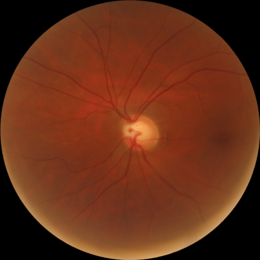</td>
<td>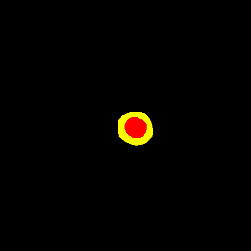</td>
<td></td>
</tr>
<tr>
<td>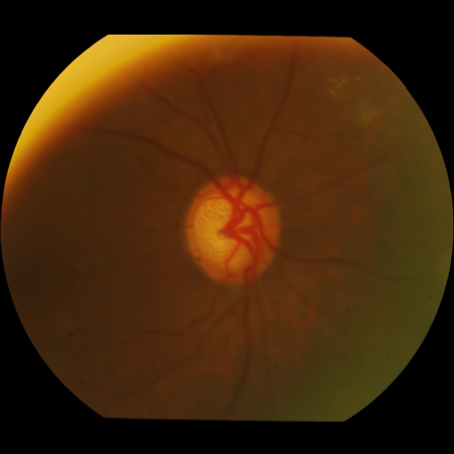</td>
<td>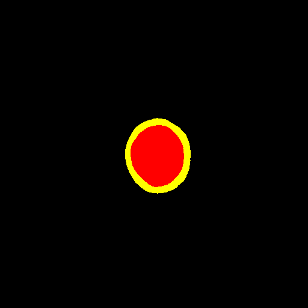</td>
<td>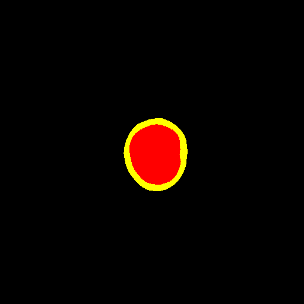</td>
</tr>
<tr>
<td>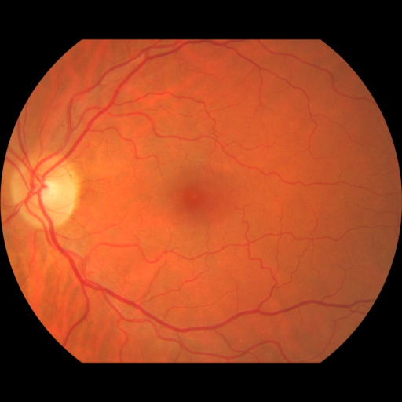</td>
<td>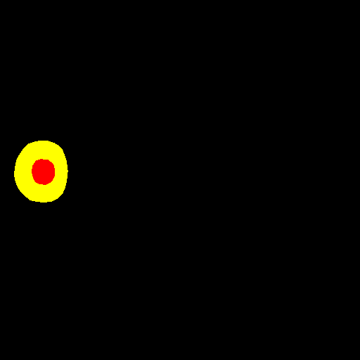</td>
<td></td>
</tr>
</table>

 
<h3>1  Dataset Citation</h3>
The dataset used here was derived from   
<a href="https://www.kaggle.com/datasets/deathtrooper/multichannel-glaucoma-benchmark-dataset">
<b>SMDG, A Standardized Fundus Glaucoma Dataset</b></a> 
<b>Standardized Multi-Channel Dataset for Glaucoma of 19 public datasets (SMDG-19)</b> on the kaggle.com
  
The following explanation was taken from the above kaggle web site.
  
<b>About Dataset</b> 
<b>Standardized Multi-Channel Dataset for Glaucoma (SMDG-19), a standardization of 19 public glaucoma datasets for AI applications.</b>.
  
Standardized Multi-Channel Dataset for Glaucoma (SMDG-19) is a collection and standardization of 19 public datasets, 
comprised of full-fundus glaucoma images, associated image metadata like, optic disc segmentation, 
optic cup segmentation, blood vessel segmentation, and any provided per-instance text metadata like sex and age.  
This dataset is designed to be exploratory and open-ended with multiple use cases and no established training/validation/test cases. 
 
This dataset is the largest public repository of fundus images with glaucoma.
  
<b>Citation</b> 
1. Kiefer, Riley, et al. "A Catalog of Public Glaucoma Datasets for Machine Learning Applications: 
A detailed description and analysis of public glaucoma datasets available to machine learning engineers tackling glaucoma-related problems using retinal fundus images and OCT images.
" Proceedings of the 2023 7th International Conference on Information System and Data Mining. 2023.
  
2. R. Kiefer, M. Abid, M. R. Ardali, J. Steen and E. Amjadian, 
"Automated Fundus Image Standardization Using a Dynamic Global Foreground Threshold Algorithm," 
2023 8th International Conference on Image, Vision and Computing (ICIVC), Dalian, 
China, 2023, pp. 460-465, doi: 10.1109/ICIVC58118.2023.10270429.
  
3. Kiefer, Riley, et al. "A Catalog of Public Glaucoma Datasets for Machine Learning Applications: 
A detailed description and analysis of public glaucoma datasets available to machine learning 
engineers tackling glaucoma-related problems using retinal fundus images and OCT images.
" Proceedings of the 2023 7th International Conference on Information System and Data Mining. 2023.
  
4. R. Kiefer, J. Steen, M. Abid, M. R. Ardali and E. Amjadian, "A Survey of Glaucoma Detection Algorithms using Fundus and OCT Images," 2022 IEEE 13th Annual Information Technology,
 Electronics and Mobile Communication Conference (IEMCON), Vancouver, BC, Canada, 2022, pp. 0191-0196, doi: 
 10.1109/IEMCON56893.2022.9946629.
  
<b>DOI Citation</b> 
<pre>
 SMDG; @dataset{smdg,
    title={SMDG,
    A Standardized Fundus Glaucoma Dataset},
    url={https://www.kaggle.com/ds/2329670},
    DOI={10.34740/KAGGLE/DS/2329670},
    publisher={Kaggle},
    author={Riley Kiefer},
   year={2023}
</pre>
 
 
<b>Data Standardization</b> 
<ul>
<li>Full fundus images (and corresponding segmentation maps) are standardized using a novel algorithm (Citation 1) by cropping the background, centering the fundus image, padding missing information, and resizing to 512x512 pixels. This standardization ensures that the most amount of foreground information is prevalent during the resizing process for machine-learning-ready image processing.
</li>
<li>Each available metadata text is standardized by provided each fundus image as a row and each fundus attribute as a column in a CSV file
</li>
</ul>
<b>License</b> 
Other (specified in description)
  
For more information, please refer to <a href="https://github.com/TheBeastCoding/standardized-multichannel-dataset-glaucoma">
<b>Standardized Multi-Channel Dataset for Glaucoma (SMDG-19), a standardization of 19 public datasets for AI applications.</b></a>
 
 
<h3>
2 SMDG-Glaucoma ImageMask Dataset
</h3>
 If you would like to train this SMDG-Glaucoma Segmentation model by yourself,
please down load  the <a href="https://drive.google.com/file/d/13JrBJXzsw_DzMQ7JbgDXRqdAZIUCzKR6/view?usp=sharing">
 SMDG-Glaucoma-ImageMask-Dataset.zip
 </a> on the google driive.
</b>  
<pre>
./dataset
└─SMDG-Glaucoma
    ├─test
    │   ├─images
    │   └─masks
    ├─train
    │   ├─images
    │   └─masks
    └─valid
        ├─images
        └─masks
</pre>
 
<b>SMDG-Glaucoma Statistics</b> 
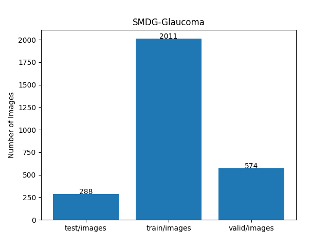 
 
As shown above, the number of images of train and valid datasets is large enough to use for a training set of our segmentation model.
  

<b>Train_images_sample</b> 
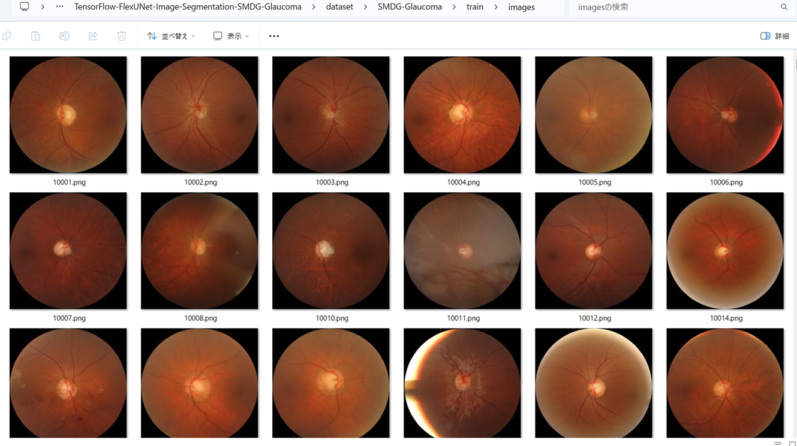
 
<b>Train_masks_sample</b> 
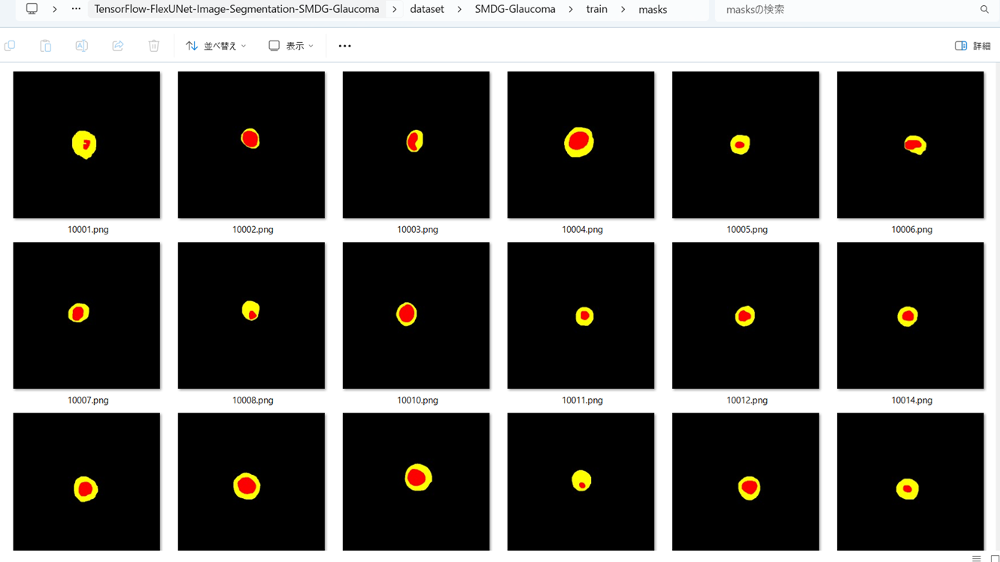
 
<h3>
3 Train TensorflowFlexUNet Model
</h3>
 We trained SMDG-Glaucoma TensorflowFlexUNet Model by using the following
<a href="./projects/TensorFlowFlexUNet/SMDG-Glaucoma/train_eval_infer.config"> <b>train_eval_infer.config</b></a> file.  
Please move to ./projects/TensorFlowFlexUNet/SMDG-Glaucoma and run the following bat file. 
<pre>
>1.train.bat
</pre>
, which simply runs the following command. 
<pre>
>python ../../../src/TensorFlowFlexUNetTrainer.py ./train_eval_infer.config
</pre>

<b>Model parameters</b> 
Defined a small <b>base_filters=16</b> and a large <b>base_kernels=(11,11)</b> for the first Conv Layer of Encoder Block of 
<a href="./src/TensorFlowFlexUNet.py">TensorFlowFlexUNet.py</a> 
and a large num_layers (including a bridge between Encoder and Decoder Blocks).
<pre>
[model]
image_width    = 512
image_height   = 512
image_channels = 3
input_normalize = True
normalization  = False
num_classes    = 3
base_filters   = 16
base_kernels  = (11,11)
num_layers    = 8
dropout_rate   = 0.05
dilation       = (1,1)
</pre>

<b>Learning rate</b> 
Defined a small learning rate.  
<pre>
[model]
learning_rate  = 0.00007
</pre>

<b>Loss and metrics functions</b> 
Specified "categorical_crossentropy" and "dice_coef_multiclass". 
<pre>
[model]
loss           = "categorical_crossentropy"
metrics        = ["dice_coef_multiclass"]
</pre>
<b >Learning rate reducer callback</b> 
Enabled learing_rate_reducer callback, and a small reducer_patience.
<pre> 
[train]
learning_rate_reducer = True
reducer_factor     = 0.5
reducer_patience   = 4
</pre>
<b>Early stopping callback</b> 
Enabled early stopping callback with patience parameter.
<pre>
[train]
patience      = 10
</pre>
<b></b> 
<b>RGB color map</b> 
rgb color map dict for SMDG-Glaucoma 1+2 classes. 
<pre>
[mask]
mask_file_format = ".png"
;SMDG-Glaucoma 1+2
rgb_map = {(0,0,0):0, (255,255,0):1, (255,0,0):2} 
</pre>
<b>Epoch change inference callbacks</b> 
Enabled epoch_change_infer callback. 
<pre>
[train]
epoch_change_infer       = True
epoch_change_infer_dir   =  "./epoch_change_infer"
epoch_changeinfer        = False
epoch_changeinfer_dir    = "./epoch_changeinfer"
num_infer_images         = 6
</pre>
By using this epoch_change_infer callback, on every epoch_change, the inference procedure can be called
 for 6 images in <b>mini_test</b> folder. This will help you confirm how the predicted mask changes 
 at each epoch during your training process.    
<b>Epoch_change_inference output at starting (1,2,3)</b> 
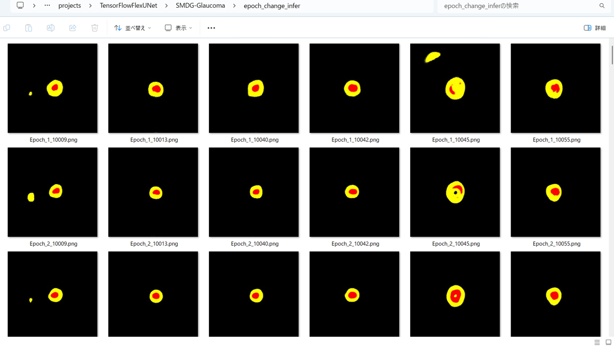 
 
<b>Epoch_change_inference output at middle-point (20,21,22)</b> 
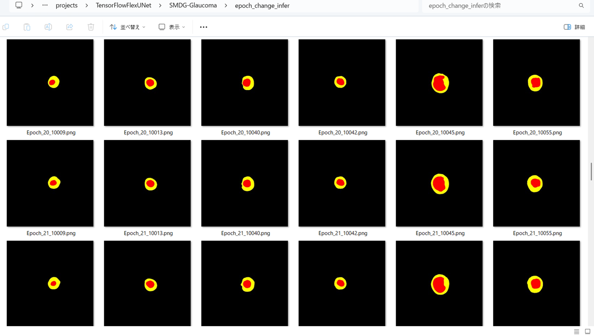 
 
<b>Epoch_change_inference output at ending (42,43,44)</b> 
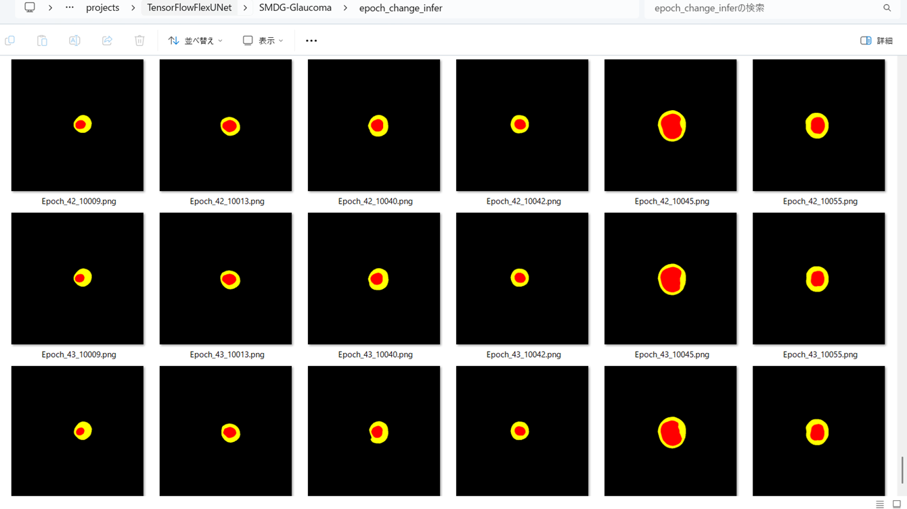 

 
In this experiment, the training process was stopped at epoch 44 by EarlyStoppingCallback.  
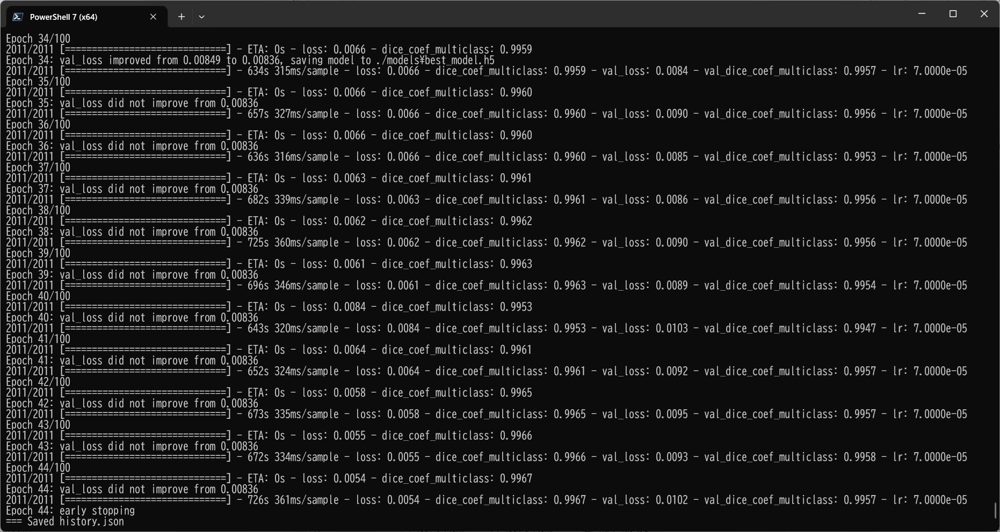 
 
<a href="./projects/TensorFlowFlexUNet/SMDG-Glaucoma/eval/train_metrics.csv">train_metrics.csv</a> 
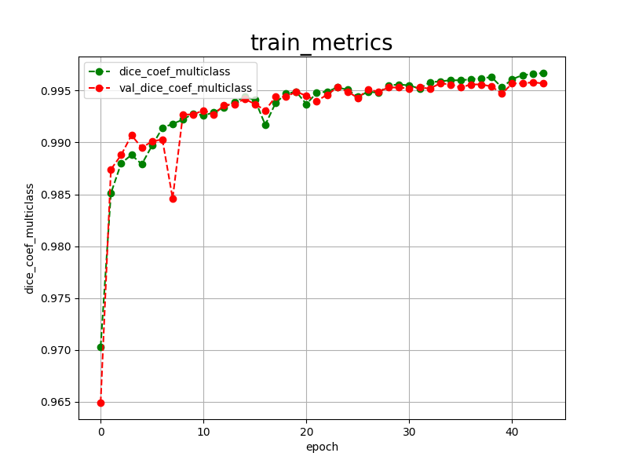 

 
<a href="./projects/TensorFlowFlexUNet/SMDG-Glaucoma/eval/train_losses.csv">train_losses.csv</a> 
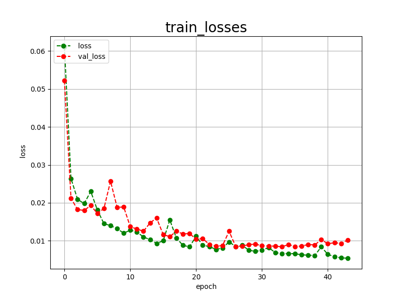 
 
<h3>
4 Evaluation
</h3>
Please move to a <b>./projects/TensorFlowFlexUNet/SMDG-Glaucoma</b> folder, 
and run the following bat file to evaluate TensorflowFlexUNet model for SMDG-Glaucoma. 
<pre>
>./2.evaluate.bat
</pre>
This bat file simply runs the following command.
<pre>
>python ../../../src/TensorFlowFlexUNetEvaluator.py  ./train_eval_infer.config
</pre>
Evaluation console output: 
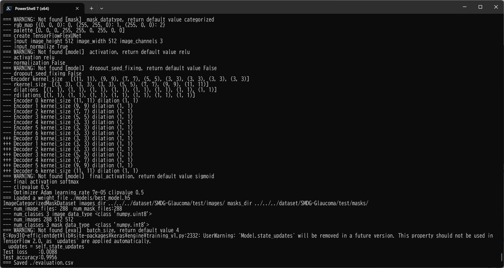
  Image-Segmentation-SMDG-Glaucoma

<a href="./projects/TensorFlowFlexUNet/SMDG-Glaucoma/evaluation.csv">evaluation.csv</a> 
The loss (categorical_crossentropy) to this SMDG-Glaucoma/test was very low, and dice_coef_multiclass very high as shown below.
 
<pre>
categorical_crossentropy,0.0088
dice_coef_multiclass,0.9956
</pre>
 
<h3>5 Inference</h3>
Please move to a <b>./projects/TensorFlowFlexUNet/SMDG-Glaucoma</b> folder 
,and run the following bat file to infer segmentation regions for images by the Trained-TensorflowFlexUNet model for SMDG-Glaucoma. 
<pre>
>./3.infer.bat
</pre>
This simply runs the following command.
<pre>
>python ../../../src/TensorFlowFlexUNetInferencer.py ./train_eval_infer.config
</pre>

<b>mini_test_images</b> 
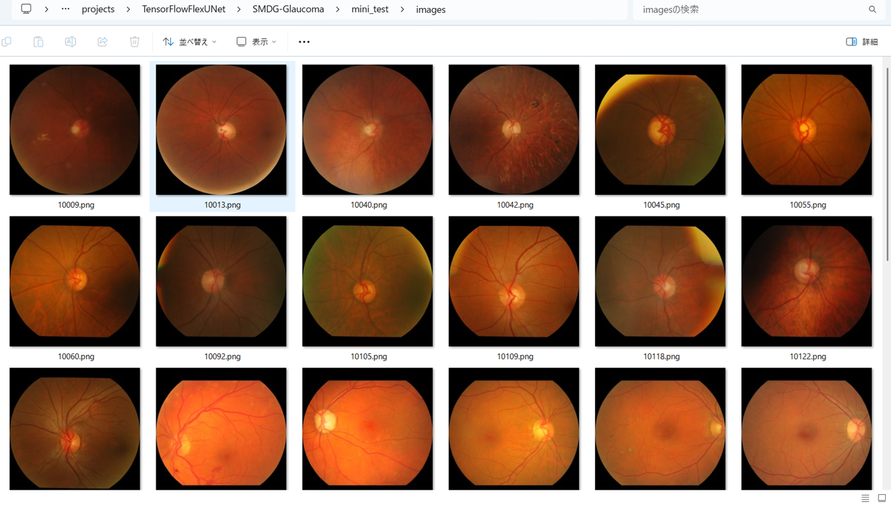 
<b>mini_test_mask(ground_truth)</b> 
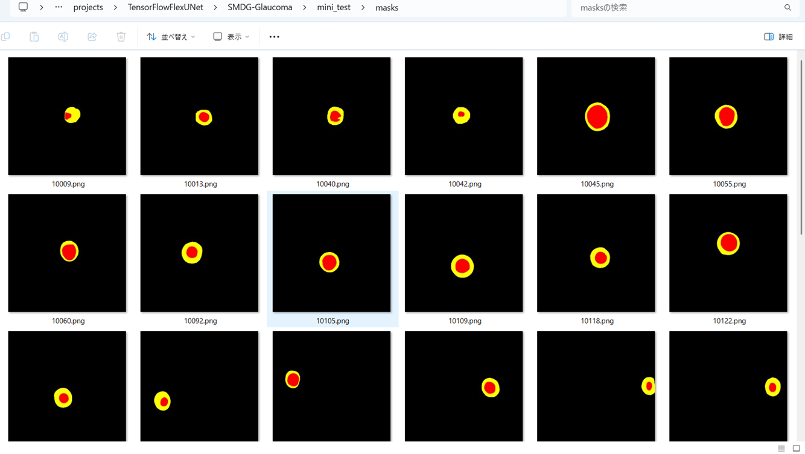 

<b>Inferred test masks</b> 
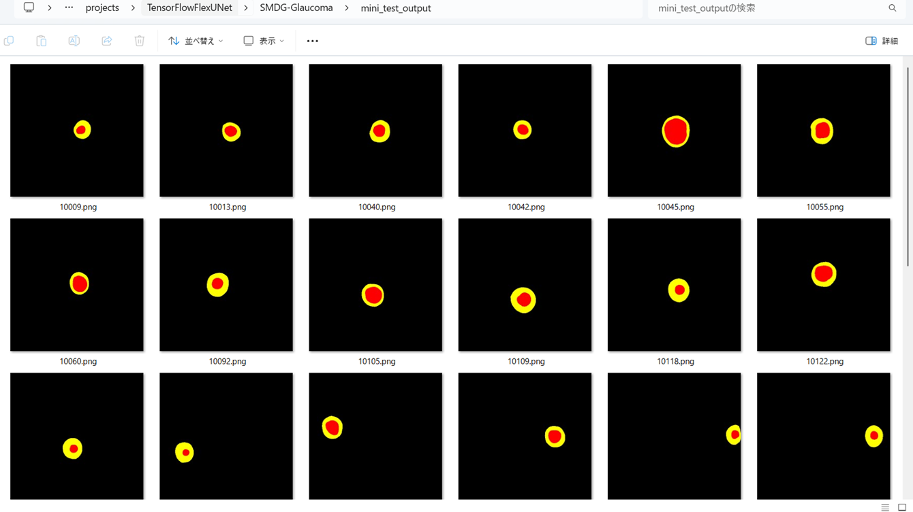 
 

<b>Enlarged images and masks for  SMDG-Glaucoma  Images </b> 
As shown below, the inferred masks predicted by our segmentation model trained by the dataset appear similar to the ground truth masks.
 
<b>rgb_map = {Optic Disc: yellow, Optic Cup: red} </b> 
 
<table>
<tr>
<th>Input: image</th>
<th>Mask (ground_truth)</th>
<th>Prediction: inferred_mask</th>
</tr>
<tr>
<td>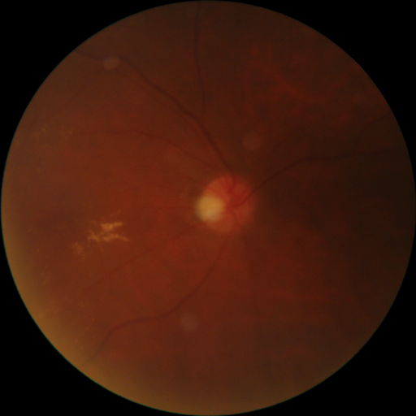</td>
<td></td>
<td>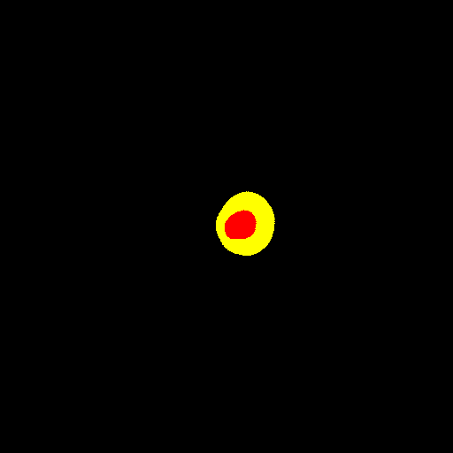</td>
</tr>
<tr>
<td>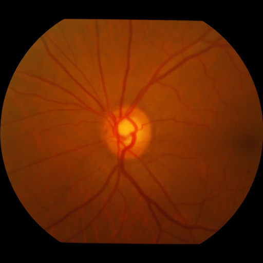</td>
<td>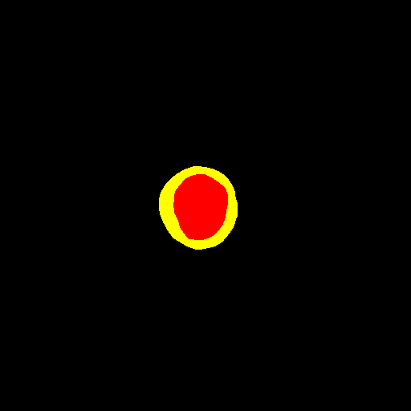</td>
<td>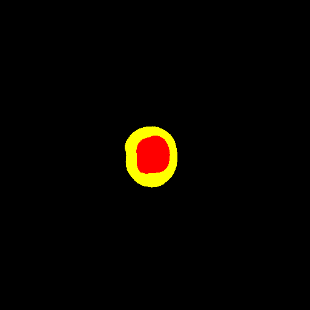</td>
</tr>
<tr>
<td>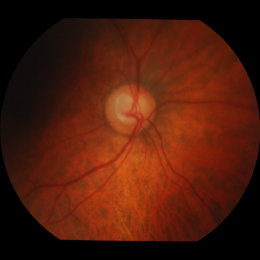</td>
<td>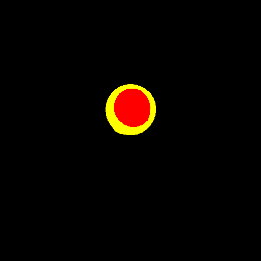</td>
<td>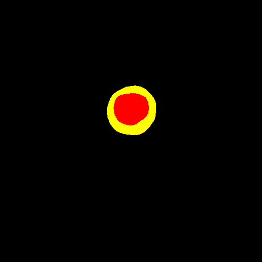</td>
</tr>

<tr>
<td>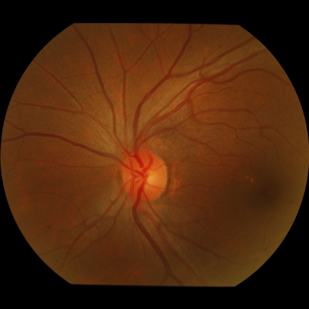</td>
<td>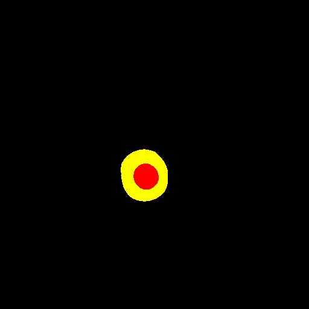</td>
<td></td>
</tr>
<tr>
<td>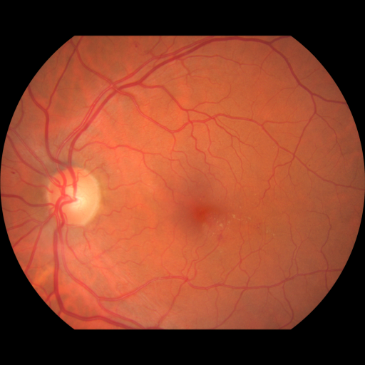</td>
<td></td>
<td>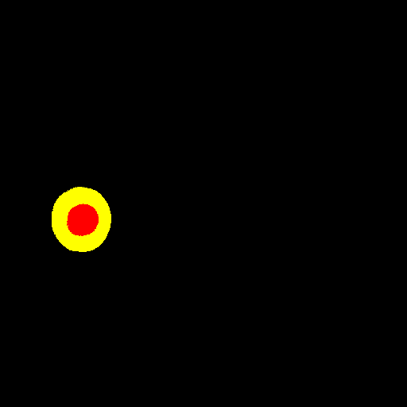</td>
</tr>
<tr>
<td>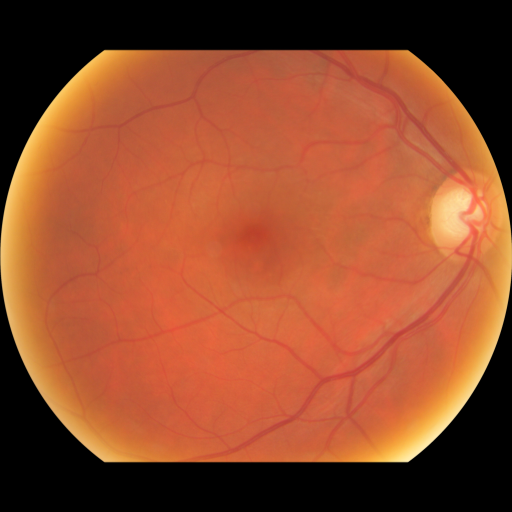</td>
<td></td>
<td></td>
</tr>
</table>

 
<h3>
References
</h3>
<b>1. Optic Disc and Optic Cup Segmentation Methodologies for Glaucoma Image Detection: A Survey</b> 
Ahmed Almazroa, Ritambhar Burman, Kaamran Raahemifar, Vasudevan Lakshminarayanan  
<a href="https://pmc.ncbi.nlm.nih.gov/articles/PMC4673359/">
https://pmc.ncbi.nlm.nih.gov/articles/PMC4673359/
</a>
  
<b>2. Segmentation and Classification of Glaucoma Using U-Net with Deep Learning Model</b> 
M.B. Sudhan, M. Sinthuja, S. Pravinth Raja, J. Amutharaj, G. Charlyn Pushpa Latha, S. Sheeba Rachel, T. Anitha, T. Rajendran, Yosef Asrat Waji 
<a href="https://onlinelibrary.wiley.com/doi/10.1155/2022/1601354?msockid=3ec756cfd5d167d7342f47c9d4de66ff">
https://onlinelibrary.wiley.com/doi/10.1155/2022/1601354?msockid=3ec756cfd5d167d7342f47c9d4de66ff</a>
  
<b>3. Glaucoma detection from retinal fundus images using graph convolution based multi-task model</b> 
Satyabrata Lenka, Zefree Lazarus Mayaluri, Ganapati Panda 
<a href="https://www.sciencedirect.com/science/article/pii/S2772671125000385">
https://www.sciencedirect.com/science/article/pii/S2772671125000385</a>
 
 
<b>4. Energetic Glaucoma Segmentation and Classification Strategies Using Depth Optimized Machine Learning Strategies</b> 
V Elizabeth Jesi, Shabnam Mohamed Aslam, G Ramkumar, A Sabarivani, A K Gnanasekar, Prince Thomas 
<a href="https://pmc.ncbi.nlm.nih.gov/articles/PMC8639261/">https://pmc.ncbi.nlm.nih.gov/articles/PMC8639261/</a>
  
<b>5. TensorFlow-FlexUNet-Image-Segmentation-Glaucoma-Fundus</b> 
Toshiyuki Arai  
<a href="https://github.com/sarah-antillia/TensorFlow-FlexUNet-Image-Segmentation-Glaucoma-Fundus">
https://github.com/sarah-antillia/TensorFlow-FlexUNet-Image-Segmentation-Glaucoma-Fundus
</a>
 
 
<b>6. TensorFlow-FlexUNet-Image-Segmentation-Drishti-Glaucoma</b> 
Toshiyuki Arai  
<a href="https://github.com/sarah-antillia/TensorFlow-FlexUNet-Image-Segmentation-Drishti-Glaucoma">
https://github.com/sarah-antillia/TensorFlow-FlexUNet-Image-Segmentation-Drishti-Glaucoma
</a>
 
 
<b>7. TensorFlow-FlexUNet-Image-Segmentation-Model</b> 
Toshiyuki Arai  
<a href="https://github.com/sarah-antillia/TensorFlow-FlexUNet-Image-Segmentation-Model">
https://github.com/sarah-antillia/TensorFlow-FlexUNet-Image-Segmentation-Model
</a>
 
 
